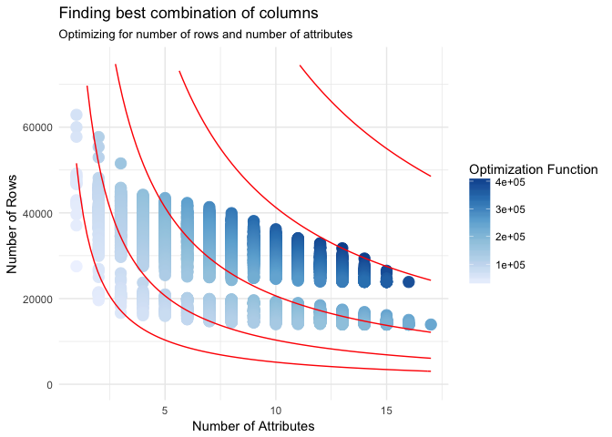

Final Project
================
kimchi-stew
May 4th, 2018

\#\#\#Set up

### Load Packages & Data

### Introduction

For our final project, we worked with a Yelp dataset. Yelp is a web and
mobile platform that publishes crowd-sourced reviews about local
businesses, as well as online reservation service through Yelp
reservations. The data we used was released by the Yelp Dataset
Challenge to encourage students to conduct research and analysis. The
scope of the dataset is extremely wide including business information,
reviews and user data. Even the business subset contains information
about 174,000 businesses and over 1.2 million business attributes, such
as workday hours, parking, and ambience. Given this huge dataset, we
decided to narrow down our interests and perform analysis specifically
on the restaurant data. We were interested in exploring what attribute
contribute to high restaurant star ratings on Yelp. Eventually, we
wanted to construct a regression model that predicts the star ratings of
restaurants based on their attributes.

We started by converting dataset from JSON form to CSV files. The R
package jsonlite was used to stream in the json file and flatten it. The
conversion happened in the load-data R script, in which we also cleaned
up the data using functions from the stringr package. In addition, the
data was split into multiple, csv subsets that can later be joined by
the common variable, business\_id. 1) Food.csv (general business
information): 69070 observations and 13 variables, including name, city,
state, longitude, latitude, categories, etc. 2) Food\_attributes.csv
(business attributes information): 69070 observations and 66 variables,
including GoodForKids, RestaurantsAttire, WiFi, etc. 3) Food\_hours.csv
(business hour information): 69070 observations and 8 variables,
including hours.Monday, hours.Tuesday, etc.

Before building our linear model, we created rudimentary visualizations
to get a sense of the overall trend of the data.

<!-- -->

    ## # A tibble: 1 x 2
    ##    mean median
    ##   <dbl>  <dbl>
    ## 1  3.50   3.50

The first bar graph showed the counts of each star rating categories.
It’s important to note that star ratings on Yelp are not continuous,
but discrete, and the ratings change by increments of 0.5. Therefore, we
could not approximate the ratings with a normal distribution. However,
we did know from summary statistics that both mean and median star
ratings are approximately 3.5. Additionally, we should consider the
possible anchoring effect that one review could have on another. Reviews
are not random like throwing dice and adding up the sum. Both the nature
of review ratings and the discrete system implemented by Yelp should be
considered when evaluating the validity and predictability of our
multiple regression linear model.

We also did a simple map to visualize the locations of the restaurants.
This is because the Yelp website specified that there are 11
metropolitan areas within this dataset but we were seeing many more
cities than 11. Therefore we just wanted to create a visualization to
see all restaurant locations.

    ## # A tibble: 1 x 13
    ##   business_id  name  neighborhood address city  state postal_code latitude
    ##   <chr>        <chr> <chr>        <chr>   <chr> <chr> <chr>          <dbl>
    ## 1 Zmp2_b2gpSl… Terr… <NA>         Green … Hend… NV    89052           36.0
    ## # ... with 5 more variables: longitude <dbl>, stars <dbl>,
    ## #   review_count <int>, is_open <int>, categories <chr>

    ## # A tibble: 1 x 13
    ##   business_id  name  neighborhood address city  state postal_code latitude
    ##   <chr>        <chr> <chr>        <chr>   <chr> <chr> <chr>          <dbl>
    ## 1 1yQUqh3_h1I… TriB… <NA>         88 Bru… Edin… EDH   EH10 4HG        90.0
    ## # ... with 5 more variables: longitude <dbl>, stars <dbl>,
    ## #   review_count <int>, is_open <int>, categories <chr>

<!-- -->

The map graph showed that there are indeed many more cities included in
the dataset but the majority of cities are in North American and Europe.

### Methods

To make our analysis more efficient we had cut down and reformat our
code. The issues we had to solve for were the following: aggregate
related columns by some protocol and find the subset of columns that
maximize non-null rows and number of attributes.

For the first problem, there were 6 columns that were initially broken
up across around 30 columns. For example, the column GoodForMeal was
initially split up as a column for every meal encoded as true or false,
since a restaurant could be good for multiple meals. We needed to
aggregate these values into a single column, but we had to figure out
how to handle collisions when two or more columns were true. We created
a function to reduce these aggregated columns, replacing their list of
values with the value that occurs most in the
    dataset.

<!-- -->

    ## [1] "RestaurantsPriceRange2,BusinessAcceptsCreditCards,RestaurantsTakeOut,RestaurantsAttire,Alcohol,RestaurantsGoodForGroups,GoodForKids,NoiseLevel,RestaurantsTableService,HasTV,OutdoorSeating,RestaurantsReservations,RestaurantsDelivery"                 
    ## [2] "RestaurantsPriceRange2,BusinessAcceptsCreditCards,RestaurantsTakeOut,RestaurantsAttire,Alcohol,WiFi,RestaurantsGoodForGroups,GoodForKids,NoiseLevel,RestaurantsTableService,HasTV,OutdoorSeating,RestaurantsReservations,RestaurantsDelivery"            
    ## [3] "RestaurantsPriceRange2,BusinessAcceptsCreditCards,RestaurantsTakeOut,RestaurantsAttire,Alcohol,WiFi,RestaurantsGoodForGroups,GoodForKids,NoiseLevel,BikeParking,RestaurantsTableService,HasTV,OutdoorSeating,RestaurantsReservations,RestaurantsDelivery"

Now that we handled that, we had to find the subset of columns that
would maximize the amount of data that we would have. This means
maximizing rows times columns. We created a function that calculates the
amount of data in the subset of some combination of tables. To find the
optimal combination, we would have to try every possible combination of
columns, which is equivalent to the powerset of the columns. And since
we were working with 22 columns. This would be 2^22. So we clearly
couldn’t do that. To get around this we first looked at the possible
combinations of columns that actually existed in the dataset. This cut
down our search space from 2^22 to around 5000. A significant
improvement. From there we calculated the subset of the dataset that
would maximize our data.

With this full dataset, we performed a linear regression using the
following characteristics to predict star score: food within price range
of 11-30(dollars), good for kids, acceptance of credit cards, bike
parking, alcohol sold, TV present, noise level, dress code, fit for
groups, catering ability, WiFi present, accepts reservations, takeout
offered, parking available, ambience, and best mealtime.

    ## [1] 0.2330068

    ## 
    ## Call:
    ## lm(formula = stars ~ RestaurantsPriceRange2 + categories + BusinessAcceptsCreditCards + 
    ##     Alcohol + HasTV + NoiseLevel + RestaurantsGoodForGroups + 
    ##     Caters + WiFi + aggBusinessParking + aggAmbience + aggGoodForMeal + 
    ##     review_count + BikeParking + GoodForKids + RestaurantsReservations + 
    ##     RestaurantsTakeOut + RestaurantsAttire + RestaurantsGoodForGroups, 
    ##     data = food_reduce)
    ## 
    ## Coefficients:
    ##                         (Intercept)               RestaurantsPriceRange2  
    ##                           3.8491982                           -0.0248559  
    ##    categoriesamerican (traditional)               categoriesasian fusion  
    ##                          -0.1638965                           -0.1028240  
    ##                  categoriesbakeries                   categoriesbarbeque  
    ##                           0.2279677                           -0.1328092  
    ##        categoriesbreakfast & brunch                    categoriesbuffets  
    ##                          -0.0186469                           -0.7927418  
    ##                   categoriesburgers                      categoriescafes  
    ##                          -0.4231210                            0.0708344  
    ##            categoriescanadian (new)                  categoriescaribbean  
    ##                           0.0626801                            0.2355521  
    ##             categorieschicken wings                    categorieschinese  
    ##                          -0.2544552                           -0.2477567  
    ##              categoriescoffee & tea                      categoriesdelis  
    ##                           0.1666148                           -0.0860110  
    ##                  categoriesdesserts                     categoriesdiners  
    ##                           0.0585137                           -0.0154982  
    ## categoriesevent planning & services               categoriesfast burgers  
    ##                           0.0325244                           -0.8391822  
    ##                 categoriesfast food               categoriesfast mexican  
    ##                          -0.5950679                           -0.6653847  
    ##           categoriesfast sandwiches                       categoriesfood  
    ##                          -0.6663821                            0.2316108  
    ##                    categoriesfrench                     categoriesgerman  
    ##                           0.1538868                            0.2493182  
    ##                     categoriesgreek                    categoriesgrocery  
    ##                          -0.0966365                            0.3079497  
    ## categoriesice cream & frozen yogurt                     categoriesindian  
    ##                           0.2850597                           -0.0472950  
    ##                   categoriesitalian                   categoriesjapanese  
    ##                          -0.0079859                           -0.0716967  
    ##    categoriesjuice bars & smoothies                     categorieskorean  
    ##                           0.3043973                           -0.1131043  
    ##             categoriesmediterranean                    categoriesmexican  
    ##                           0.1326355                           -0.1236350  
    ##            categoriesmiddle eastern                  categoriesnightlife  
    ##                          -0.0393033                           -0.0656997  
    ##                     categoriespizza                categoriesrestaurants  
    ##                          -0.0903598                           -0.5208047  
    ##                     categoriessalad                 categoriessandwiches  
    ##                           0.1212113                           -0.0036862  
    ##                   categoriesseafood                   categoriesshopping  
    ##                          -0.0686852                            0.4653281  
    ##            categoriesspecialty food                categoriessteakhouses  
    ##                           0.1506302                           -0.1839474  
    ##                categoriessushi bars                       categoriesthai  
    ##                          -0.0576488                            0.0024246  
    ##                categoriesvietnamese             categorieswine & spirits  
    ##                          -0.0815497                            0.0660468  
    ##      BusinessAcceptsCreditCardsTRUE                      Alcoholfull_bar  
    ##                          -0.2714132                           -0.1676520  
    ##                         Alcoholnone                            HasTVTRUE  
    ##                          -0.0417623                            0.0264866  
    ##                      NoiseLevelloud                      NoiseLevelquiet  
    ##                          -0.1620077                            0.1268545  
    ##                 NoiseLevelvery_loud         RestaurantsGoodForGroupsTRUE  
    ##                          -0.3913551                           -0.0487859  
    ##                          CatersTRUE                               WiFino  
    ##                           0.1169467                           -0.0035554  
    ##                            WiFipaid                aggBusinessParkinglot  
    ##                          -0.1203979                            0.0740764  
    ##              aggBusinessParkingNone             aggBusinessParkingstreet  
    ##                          -0.0332294                            0.1676080  
    ##             aggBusinessParkingvalet          aggBusinessParkingvalidated  
    ##                           0.0221258                            0.1223344  
    ##                   aggAmbienceclassy                     aggAmbiencedivey  
    ##                           0.1485267                            0.1379329  
    ##                  aggAmbiencehipster                  aggAmbienceintimate  
    ##                           0.2571216                            0.2664053  
    ##                     aggAmbienceNone                  aggAmbienceromantic  
    ##                          -0.0792281                            0.1448438  
    ##                 aggAmbiencetouristy                    aggAmbiencetrendy  
    ##                          -0.2548824                            0.1641312  
    ##                  aggAmbienceupscale                 aggGoodForMealbrunch  
    ##                           0.2028500                            0.1840162  
    ##               aggGoodForMealdessert                 aggGoodForMealdinner  
    ##                           0.0892061                            0.1971668  
    ##             aggGoodForMeallatenight                  aggGoodForMeallunch  
    ##                           0.0223419                            0.1190729  
    ##                  aggGoodForMealNone                         review_count  
    ##                           0.0566848                            0.0004052  
    ##                     BikeParkingTRUE                      GoodForKidsTRUE  
    ##                           0.0711981                           -0.0726078  
    ##         RestaurantsReservationsTRUE               RestaurantsTakeOutTRUE  
    ##                           0.0104564                           -0.1221721  
    ##             RestaurantsAttiredressy              RestaurantsAttireformal  
    ##                           0.1103737                            0.2527329

This linear model suggests that in an alternate reality, if a restaurant
demonstrated none of the above characteristics, the star rating would be
3.86. For each attribute a restaurant has, its rating increases or
decreases according to each attribute’s coefficient multiplied by the
value assigned to the attribute. The adjusted R-squared value for this
linear model is 0.233, meaning that this model accounts for
approximately 23.3% of the variability in the stars values. This low
score indicates that the linear regression model insufficiently
describes the data and has low predictive power.

    ## 
    ## Regression tree:
    ## rpart(formula = stars ~ categories + BusinessAcceptsCreditCards + 
    ##     RestaurantsPriceRange2 + GoodForKids + BikeParking + Alcohol + 
    ##     HasTV + NoiseLevel + RestaurantsAttire + RestaurantsGoodForGroups + 
    ##     Caters + WiFi + RestaurantsReservations + RestaurantsTakeOut + 
    ##     aggBusinessParking + aggAmbience + aggGoodForMeal, data = food_reduce, 
    ##     method = "anova")
    ## 
    ## Variables actually used in tree construction:
    ## [1] aggAmbience    aggGoodForMeal categories    
    ## 
    ## Root node error: 10027/22410 = 0.44742
    ## 
    ## n= 22410 
    ## 
    ##         CP nsplit rel error  xerror      xstd
    ## 1 0.068802      0   1.00000 1.00014 0.0099140
    ## 2 0.025011      1   0.93120 0.93152 0.0088306
    ## 3 0.020776      2   0.90619 0.90783 0.0087151
    ## 4 0.016035      3   0.88541 0.88927 0.0086588
    ## 5 0.013138      4   0.86938 0.87515 0.0085808
    ## 6 0.010000      5   0.85624 0.86406 0.0084920

<!-- -->

    ## n= 22410 
    ## 
    ## node), split, n, deviance, yval
    ##       * denotes terminal node
    ## 
    ## 1) root 22410 10026.6100 3.538019  
    ##   2) categories=buffets,burgers,fast burgers,fast food,fast mexican,fast sandwiches,restaurants 1553  1128.8920 2.895042  
    ##     4) aggGoodForMeal=breakfast,brunch,None 730   478.7223 2.506164 *
    ##     5) aggGoodForMeal=dessert,dinner,latenight,lunch 823   441.8548 3.239976 *
    ##   3) categories=american (new),american (traditional),asian fusion,bakeries,barbeque,breakfast & brunch,cafes,canadian (new),caribbean,chicken wings,chinese,coffee & tea,delis,desserts,diners,event planning & services,food,french,german,greek,grocery,ice cream & frozen yogurt,indian,italian,japanese,juice bars & smoothies,korean,mediterranean,mexican,middle eastern,nightlife,pizza,salad,sandwiches,seafood,shopping,specialty food,steakhouses,sushi bars,thai,vietnamese,wine & spirits 20857  8207.8700 3.585894  
    ##     6) categories=american (traditional),asian fusion,barbeque,chicken wings,chinese,delis,greek,korean,mexican,nightlife,pizza,steakhouses 12214  4760.2580 3.493655 *
    ##     7) categories=american (new),bakeries,breakfast & brunch,cafes,canadian (new),caribbean,coffee & tea,desserts,diners,event planning & services,food,french,german,grocery,ice cream & frozen yogurt,indian,italian,japanese,juice bars & smoothies,mediterranean,middle eastern,salad,sandwiches,seafood,shopping,specialty food,sushi bars,thai,vietnamese,wine & spirits 8643  3196.8390 3.716244 *

<!-- -->

Since the R-squared value we got from the multiple linear regression
model was quite low, we wanted to explore results from other potential
regression methods. Our next attempt was to build a regression decision
tree using the rpart package. The decision tree algorithm is better at
capturing non-linearity in the data by dividing space into smaller
sub-spaces. In the following code chunk, we grew the tree using the same
variables as we had in the multiple linear regression model. The
resulting R-squared of the model was 0.14736, meaning that approximately
14.7% of the variability in the star ratings was accounted for by the
model.

Next, we plotted two graph p1 and p2. P1 showed the predicted stars
vs. acutal stars and we colored that data point by restaurant
categories. P2 demonstrated the residuals vs. predicted stars. The
center of the residual plot is approximately in the middle with data
points radiating in a circular
shape.

<!-- --><!-- -->

<!-- -->

    ##           [,1]
    ## [1,] 0.2872312

<!-- -->

    ## 
    ## Call:
    ##  randomForest(formula = stars ~ RestaurantsPriceRange2 + categories +      BusinessAcceptsCreditCards + Alcohol + HasTV + NoiseLevel +      RestaurantsGoodForGroups + Caters + WiFi + aggBusinessParking +      aggAmbience + aggGoodForMeal + review_count + BikeParking +      GoodForKids + RestaurantsReservations + RestaurantsTakeOut +      RestaurantsAttire + RestaurantsGoodForGroups, data = train_full,      importance = TRUE, ntree = 50) 
    ##                Type of random forest: regression
    ##                      Number of trees: 50
    ## No. of variables tried at each split: 6
    ## 
    ##           Mean of squared residuals: 0.3325849
    ##                     % Var explained: 25.79

    ## # A tibble: 1 x 23
    ##   name        neighborhood     city   state stars review_count categories 
    ##   <chr>       <chr>            <chr>  <chr> <dbl>        <int> <fct>      
    ## 1 Café Myria… Plateau-Mont-Ro… Montr… QC       4.           37 coffee & t…
    ## # ... with 16 more variables: BusinessAcceptsCreditCards <lgl>,
    ## #   RestaurantsPriceRange2 <int>, GoodForKids <lgl>, BikeParking <lgl>,
    ## #   Alcohol <fct>, HasTV <lgl>, NoiseLevel <fct>, RestaurantsAttire <fct>,
    ## #   RestaurantsGoodForGroups <lgl>, Caters <lgl>, WiFi <fct>,
    ## #   RestaurantsReservations <lgl>, RestaurantsTakeOut <lgl>,
    ## #   aggBusinessParking <fct>, aggAmbience <fct>, aggGoodForMeal <fct>

Next, we constructed a random forest. The random forest algorithm is an
ensemble learning method that can be used for classification, regression
and other tasks. By training a multitude of decision trees, random
forest is optimized to have better predicted power. It discovers more
complex dependencies at the cost of more time needed to fit a model.
Compared to linear regression, random forest outperforms when there are
nonlinear dependencies. The resulting R-squared of the model was 0.277,
meaning that approximately 27.7% of the variability in the star ratings
was accounted for by the model. In addition we got RMSE of 0.333, giving
a standard deviation of 0.57. From this we can construct a 95%
confidence interval around our predictions. We are 95% confident that
the actual star rating will be between ±1.14 stars of the predicted
value.

    ##    categories predicted_score r.squared                      name
    ## 1   fast food        3.812142     0.367                  Hot-Star
    ## 2   fast food        3.732741     0.367               Chick-fil-A
    ## 3   fast food        3.706304     0.367 Flock Rotisserie + Greens
    ## 4   nightlife        4.170078     0.271       Hakkasan Restaurant
    ## 5   nightlife        4.167543     0.271   Yours Truly Restaurants
    ## 6   nightlife        4.163434     0.271           The Refuge Cafe
    ## 7     burgers        3.987809     0.271                 The Stand
    ## 8     burgers        3.986583     0.271     Aioli Gourmet Burgers
    ## 9     burgers        3.840383     0.271                 Five Guys
    ## 10    mexican        4.076791     0.233             Backyard Taco
    ##              neighborhood      city state stars review_count
    ## 1           Downtown Core   Toronto    ON   3.5          218
    ## 2                    <NA>   Phoenix    AZ   4.0           96
    ## 3  Entertainment District   Toronto    ON   4.0           97
    ## 4               The Strip Las Vegas    NV   4.0          372
    ## 5                    <NA>    Mentor    OH   3.5           40
    ## 6                    <NA>   Phoenix    AZ   4.5          173
    ## 7                    <NA>   Phoenix    AZ   4.0          784
    ## 8                    <NA>   Phoenix    AZ   4.0          135
    ## 9                Eastside Las Vegas    NV   4.0          109
    ## 10                   <NA>      Mesa    AZ   4.5          892
    ##    BusinessAcceptsCreditCards RestaurantsPriceRange2 GoodForKids
    ## 1                        TRUE                      2        TRUE
    ## 2                        TRUE                      1        TRUE
    ## 3                        TRUE                      2        TRUE
    ## 4                        TRUE                      4       FALSE
    ## 5                        TRUE                      2        TRUE
    ## 6                        TRUE                      1        TRUE
    ## 7                        TRUE                      1        TRUE
    ## 8                        TRUE                      2        TRUE
    ## 9                        TRUE                      1        TRUE
    ## 10                       TRUE                      1        TRUE
    ##    BikeParking       Alcohol HasTV NoiseLevel RestaurantsAttire
    ## 1         TRUE          none FALSE    average            casual
    ## 2         TRUE          none FALSE    average            casual
    ## 3        FALSE          none FALSE    average            casual
    ## 4        FALSE      full_bar FALSE    average            dressy
    ## 5         TRUE beer_and_wine  TRUE    average            casual
    ## 6         TRUE beer_and_wine  TRUE      quiet            casual
    ## 7         TRUE          none FALSE    average            casual
    ## 8         TRUE          none  TRUE    average            casual
    ## 9         TRUE          none FALSE    average            casual
    ## 10        TRUE          none FALSE    average            casual
    ##    RestaurantsGoodForGroups Caters WiFi RestaurantsReservations
    ## 1                     FALSE  FALSE   no                   FALSE
    ## 2                      TRUE   TRUE free                   FALSE
    ## 3                     FALSE   TRUE free                   FALSE
    ## 4                      TRUE  FALSE free                    TRUE
    ## 5                      TRUE   TRUE free                   FALSE
    ## 6                      TRUE  FALSE free                   FALSE
    ## 7                      TRUE  FALSE   no                   FALSE
    ## 8                      TRUE   TRUE free                    TRUE
    ## 9                      TRUE  FALSE   no                   FALSE
    ## 10                     TRUE   TRUE   no                   FALSE
    ##    RestaurantsTakeOut aggBusinessParking aggAmbience aggGoodForMeal
    ## 1                TRUE             street      casual          lunch
    ## 2                TRUE                lot      casual      breakfast
    ## 3                TRUE             street      casual          lunch
    ## 4               FALSE              valet     upscale         dinner
    ## 5                TRUE                lot      casual         brunch
    ## 6                TRUE                lot      casual         brunch
    ## 7                TRUE                lot      casual         dinner
    ## 8                TRUE                lot      casual         dinner
    ## 9                TRUE                lot      casual         dinner
    ## 10               TRUE                lot      casual         dinner

Finally, we used this random forest analysis to look at subsets of our
dataset. We looked at the most frequent categories and then one by one
filtered the dataset by one of them. We did a random forest analysis for
each one, getting R-squared values as well as the top row in that
dataset with the highest predicted star rating. Interestingly,
fast\_food was the category whose star values were best predicted by the
data — it had an R-squared value of 38%\!

### Discussion and Conclusions

Of the three analytical methods we used, the random forest algorithm
best predicted the star rating of a restaurant. The algorithm accounted
for 27.7% of the variance in the star data, a greater percentage than
either the linear regression model (23.3%) or the decision tree
algorithm (14.7%). This hierarchy in results isn’t unusual, as the
random forest algorithm is a machine learning algorithm that trains a
multitude of decision trees, rather than just one, to optimize fit to a
dataset. The failure of the individual decision tree is likely because
of the 19 variables inputted into the simple decision tree, only four
were used to predict star rating, leading to possible
underspecification. Lastly, the low R-squared value for linear
regression model implies that this model poorly predicts star rating,
and possibly that the data is non-linear. If the data is truly
non-linear, the results for the random forest and decision tree
algorithms would be similarly affected. In conclusion, of the three
methods we used, the random forest algorithm was most accurate in
predicting star rating. At first, we believed that our low R-squared
value for the linear regression model was because our data was
non-linear. However, both the random forest and decision tree algorithms
are further optimized for non-linear data, and they also returned low
R-squared values. This ultimately suggests that our research question
can’t be answered with this dataset, and that in future project
explorations, we should investigate different kinds of questions.

The primary difficulty we encountered in this project was preparing our
rough data into a dataset we could use for analysis. For several
variables, such as BusinessParking and GoodForMeal, the data was not
aggregated, so we recoded the variables so that they presented
information in levels, rather than multiple variable columns. Another
challenge was determining which variables were most relevant to our
analysis. Our process involved trying many different combinations of
columns and then checking how many observations with those variables had
no null values. We optimized for both the maximum number of columns as
well as for non-null values. Ultimately, we determined that the
aforementioned set of variables produced the largest number of
observations with non-null values.

The principal failure of our project is that our analysis cannot address
the intangible, qualitative aspects of what leads to a restaurant
earning more stars on Yelp. Star ratings are not completely random.
There are many factors that can affect how a user decides on a
particular restaurant rating. For example, personal taste is a huge
factor in an individual’s decision-making process, and because taste
varies significantly across individuals, there is no standardized way
measure it. Factors such as distance to a restaurant or neighborhood can
greatly influence individual choice. Depending on the location, an
individual’s ability to even reach certain restaurant locations varies.
Restaurant rating on Yelp is based on the feedback of its users, thus
restaurants can fall victim to the anchoring effect. Previous positive
reviews or a high star rating influence the subsequent reviews and
ratings by other users of the same restaurant. Consequently, we cannot
say with confidence that any star rating is an objective measure of a
restaurant’s quality. Furthermore, Yelp requires users to rank
restaurants in 0.5 increments and similarly rounds the mean star rating
to the nearest 0.5 value. Because the predicted results are calculated
in a continuous fashion, they will always be off from the actual,
possible star values. Considering both the limitations of human ratings
and Yelp’s use of a discrete rating system, the research question we
have asked for this dataset might not receive the best predicted value.

There are several aspects that we can do differently to improve the
results of our data analysis. As we have discussed earlier, the random
forest algorithm produces a better R-squared value as it works better
for non-linear dependencies. Therefore, we can transform our data and
fit a logarithmic or exponential regression model to evaluate whether
they produce more promising results. Additionally, we did not utilize
all relevant variables given in the dataset. For example, we can better
characterize restaurant by putting them into clusters by location and
perform regression models based on the different clusters. We can also
expand on our research question. Instead of just predicting star ratings
based on attributes, we can take a step further to provide restaurants
suggestions on how they can improve their star ratings knowing their
current attributes. This will be a more useful application of such data
analysis.
