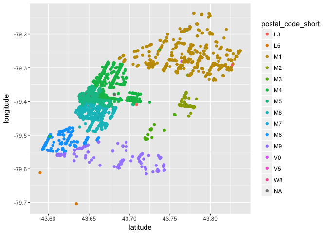
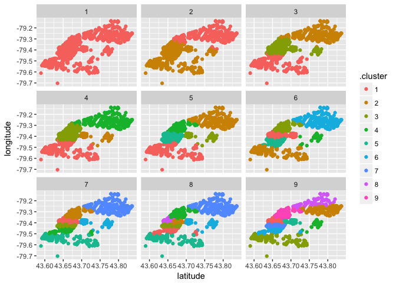

PROJECT TITLE
================
Kimchi Stew
4/23/2018

### Load Packages & Data

``` r
library(stringr)
library(tidyverse)
```

    ## ── Attaching packages ─────────────────────────────────────────────────────────────────────────────── tidyverse 1.2.1 ──

    ## ✔ ggplot2 2.2.1     ✔ readr   1.1.1
    ## ✔ tibble  1.4.2     ✔ purrr   0.2.4
    ## ✔ tidyr   0.8.0     ✔ dplyr   0.7.4
    ## ✔ ggplot2 2.2.1     ✔ forcats 0.3.0

    ## ── Conflicts ────────────────────────────────────────────────────────────────────────────────── tidyverse_conflicts() ──
    ## ✖ dplyr::filter() masks stats::filter()
    ## ✖ dplyr::lag()    masks stats::lag()

``` r
library(broom)

business <- read_csv("yelp-dataset-csv/yelp_business.csv")
```

    ## Parsed with column specification:
    ## cols(
    ##   business_id = col_character(),
    ##   name = col_character(),
    ##   neighborhood = col_character(),
    ##   address = col_character(),
    ##   city = col_character(),
    ##   state = col_character(),
    ##   postal_code = col_character(),
    ##   latitude = col_double(),
    ##   longitude = col_double(),
    ##   stars = col_double(),
    ##   review_count = col_integer(),
    ##   is_open = col_integer(),
    ##   categories = col_character()
    ## )

``` r
business_attr <- read_csv("yelp-dataset-csv/yelp_business_attributes.csv")
```

    ## Parsed with column specification:
    ## cols(
    ##   .default = col_character()
    ## )

    ## See spec(...) for full column specifications.

``` r
business_hours <- read_csv("yelp-dataset-csv/yelp_business_hours.csv")
```

    ## Parsed with column specification:
    ## cols(
    ##   business_id = col_character(),
    ##   monday = col_character(),
    ##   tuesday = col_character(),
    ##   wednesday = col_character(),
    ##   thursday = col_character(),
    ##   friday = col_character(),
    ##   saturday = col_character(),
    ##   sunday = col_character()
    ## )

``` r
yelp_review <- read_csv("yelp-dataset-csv/yelp_review.csv", n_max = 10000)
```

    ## Parsed with column specification:
    ## cols(
    ##   review_id = col_character(),
    ##   user_id = col_character(),
    ##   business_id = col_character(),
    ##   stars = col_integer(),
    ##   date = col_date(format = ""),
    ##   text = col_character(),
    ##   useful = col_integer(),
    ##   funny = col_integer(),
    ##   cool = col_integer()
    ## )

``` r
food <- business %>% 
  filter(str_detect(categories, "Food|Restaurants"))
food_ids <- food %>% 
  select(business_id) %>% 
  pull()
food_attr <- business_attr %>% 
  filter(business_id %in% food_ids)
```

### Miles

``` r
#join with attributes
business %>%
  inner_join(business_attr, by = "business_id")
```

    ## # A tibble: 152,041 x 94
    ##    business_id name  neighborhood address city  state postal_code latitude
    ##    <chr>       <chr> <chr>        <chr>   <chr> <chr> <chr>          <dbl>
    ##  1 FYWN1wneV1… "\"D… <NA>         "\"485… Ahwa… AZ    85044           33.3
    ##  2 He-G7vWjzV… "\"S… <NA>         "\"310… McMu… PA    15317           40.3
    ##  3 8DShNS-LuF… "\"S… <NA>         "\"500… Tempe AZ    85282           33.4
    ##  4 PfOCPjBrlQ… "\"B… <NA>         "\"581… Cuya… OH    44221           41.1
    ##  5 o9eMRCWt5P… "\"M… <NA>         "\"Ric… Stut… BW    70567           48.7
    ##  6 kCoE3jvEtg… "\"B… Summerlin    "\"262… Las … NV    89128           36.2
    ##  7 OD2hnuuTJI… "\"S… <NA>         "\"724… Las … NV    89128           36.2
    ##  8 EsMcGiZaQu… "\"A… <NA>         "\"261… Wexf… PA    15090           40.6
    ##  9 TGWhGNusxy… "\"D… <NA>         "\"\""  Hend… NV    89014           36.1
    ## 10 XOSRcvtaKc… "\"E… <NA>         "\"737… Hous… PA    15342           40.2
    ## # ... with 152,031 more rows, and 86 more variables: longitude <dbl>,
    ## #   stars <dbl>, review_count <int>, is_open <int>, categories <chr>,
    ## #   AcceptsInsurance <chr>, ByAppointmentOnly <chr>,
    ## #   BusinessAcceptsCreditCards <chr>, BusinessParking_garage <chr>,
    ## #   BusinessParking_street <chr>, BusinessParking_validated <chr>,
    ## #   BusinessParking_lot <chr>, BusinessParking_valet <chr>,
    ## #   HairSpecializesIn_coloring <chr>,
    ## #   HairSpecializesIn_africanamerican <chr>,
    ## #   HairSpecializesIn_curly <chr>, HairSpecializesIn_perms <chr>,
    ## #   HairSpecializesIn_kids <chr>, HairSpecializesIn_extensions <chr>,
    ## #   HairSpecializesIn_asian <chr>, HairSpecializesIn_straightperms <chr>,
    ## #   RestaurantsPriceRange2 <chr>, GoodForKids <chr>,
    ## #   WheelchairAccessible <chr>, BikeParking <chr>, Alcohol <chr>,
    ## #   HasTV <chr>, NoiseLevel <chr>, RestaurantsAttire <chr>,
    ## #   Music_dj <chr>, Music_background_music <chr>, Music_no_music <chr>,
    ## #   Music_karaoke <chr>, Music_live <chr>, Music_video <chr>,
    ## #   Music_jukebox <chr>, Ambience_romantic <chr>, Ambience_intimate <chr>,
    ## #   Ambience_classy <chr>, Ambience_hipster <chr>, Ambience_divey <chr>,
    ## #   Ambience_touristy <chr>, Ambience_trendy <chr>,
    ## #   Ambience_upscale <chr>, Ambience_casual <chr>,
    ## #   RestaurantsGoodForGroups <chr>, Caters <chr>, WiFi <chr>,
    ## #   RestaurantsReservations <chr>, RestaurantsTakeOut <chr>,
    ## #   HappyHour <chr>, GoodForDancing <chr>, RestaurantsTableService <chr>,
    ## #   OutdoorSeating <chr>, RestaurantsDelivery <chr>,
    ## #   BestNights_monday <chr>, BestNights_tuesday <chr>,
    ## #   BestNights_friday <chr>, BestNights_wednesday <chr>,
    ## #   BestNights_thursday <chr>, BestNights_sunday <chr>,
    ## #   BestNights_saturday <chr>, GoodForMeal_dessert <chr>,
    ## #   GoodForMeal_latenight <chr>, GoodForMeal_lunch <chr>,
    ## #   GoodForMeal_dinner <chr>, GoodForMeal_breakfast <chr>,
    ## #   GoodForMeal_brunch <chr>, CoatCheck <chr>, Smoking <chr>,
    ## #   DriveThru <chr>, DogsAllowed <chr>, BusinessAcceptsBitcoin <chr>,
    ## #   Open24Hours <chr>, BYOBCorkage <chr>, BYOB <chr>, Corkage <chr>,
    ## #   `DietaryRestrictions_dairy-free` <chr>,
    ## #   `DietaryRestrictions_gluten-free` <chr>,
    ## #   DietaryRestrictions_vegan <chr>, DietaryRestrictions_kosher <chr>,
    ## #   DietaryRestrictions_halal <chr>, `DietaryRestrictions_soy-free` <chr>,
    ## #   DietaryRestrictions_vegetarian <chr>, AgesAllowed <chr>,
    ## #   RestaurantsCounterService <chr>

``` r
# ratings by alcohol & good for kids
# food %>% 
#   filter(!is.na(attributes.Alcohol), !is.na(attributes.GoodForKids)) %>% 
#   group_by(attributes.GoodForKids, attributes.Alcohol) %>% 
#   summarise(mean = mean(stars),
#             n = n())

# get top # cities
food %>% 
  count(city) %>% 
  arrange(desc(n))
```

    ## # A tibble: 831 x 2
    ##    city            n
    ##    <chr>       <int>
    ##  1 Toronto      9152
    ##  2 Las Vegas    7605
    ##  3 Phoenix      4738
    ##  4 Montréal     4031
    ##  5 Charlotte    3183
    ##  6 Pittsburgh   2876
    ##  7 Edinburgh    1957
    ##  8 Scottsdale   1881
    ##  9 Cleveland    1709
    ## 10 Mississauga  1569
    ## # ... with 821 more rows

``` r
# filter for toronto, non null neighborhoods
toronto_neighborhood <- food %>% 
  filter(city == "Toronto", neighborhood != "")

# look at top neighborhoods
toronto_neighborhood %>%
  count(neighborhood) %>% 
  arrange(desc(n))
```

    ## # A tibble: 73 x 2
    ##    neighborhood                      n
    ##    <chr>                         <int>
    ##  1 Downtown Core                   839
    ##  2 Scarborough                     516
    ##  3 Etobicoke                       325
    ##  4 Entertainment District          268
    ##  5 Leslieville                     228
    ##  6 Church-Wellesley Village        205
    ##  7 Kensington Market               205
    ##  8 Willowdale                      194
    ##  9 Mount Pleasant and Davisville   181
    ## 10 Yorkville                       181
    ## # ... with 63 more rows

``` r
# aggregate postal codes (heirarchical structure so just took two few numbers)
toronto_neighborhood <- toronto_neighborhood %>%
  mutate(postal_code_short = substr(postal_code, 1 , 2))

# summary stats by neighborhood
toronto_neighborhood %>% 
  group_by(neighborhood) %>% 
  summarise(mean = mean(stars), n = n()) %>% 
  filter(n > 10) %>% 
  arrange(desc(mean))
```

    ## # A tibble: 66 x 3
    ##    neighborhood         mean     n
    ##    <chr>               <dbl> <int>
    ##  1 Ossington Strip      3.93    66
    ##  2 Rosedale             3.88    16
    ##  3 Seaton Village       3.80    38
    ##  4 Little Portugal      3.79    51
    ##  5 Distillery District  3.79    29
    ##  6 Bickford Park        3.78    55
    ##  7 Roncesvalles         3.75   107
    ##  8 High Park            3.74    51
    ##  9 The Junction         3.71   154
    ## 10 Wallace Emerson      3.71    17
    ## # ... with 56 more rows

``` r
# kmeans by attributes 7 through 10
kmns <- kmeans(toronto_neighborhood[8:11], 10)

# view kmeans results
head(augment(kmns, toronto_neighborhood))
```

    ##              business_id                     name       neighborhood
    ## 1 l09JfMeQ6ynYs5MCJtrcmQ         "Alize Catering" Yonge and Eglinton
    ## 2 lHYiCS-y8AFjUitv6MGpxg              "Starbucks"    Liberty Village
    ## 3 1K4qrnfyzKzGgJPBEcJaNQ "Chula Taberna Mexicana"        Leslieville
    ## 4 AtdXq_gu9NTE5rx4ct_dGg              "DAVIDsTEA"            Ryerson
    ## 5 dTWfATVrBfKj7Vdn0qWVWg         "Flavor Cuisine"        Scarborough
    ## 6 1nhf9BPXOBFBkbRkpsFaxA  "Mirage Grill & Lounge" Yonge and Eglinton
    ##                   address    city state postal_code latitude longitude
    ## 1         "2459 Yonge St" Toronto    ON     M4P 2H6 43.71140 -79.39934
    ## 2       "85 Hanna Avenue" Toronto    ON     M6K 3S3 43.63986 -79.41953
    ## 3 "1058 Gerrard Street E" Toronto    ON     M4M 3A6 43.66926 -79.33590
    ## 4    "10 Dundas Street E" Toronto    ON     M5B 2G9 43.65673 -79.38072
    ## 5  "8 Glen Watford Drive" Toronto    ON     M1S 2C1 43.78706 -79.27617
    ## 6 "117 Eglinton Avenue E" Toronto    ON     M4P 1H4 43.70746 -79.39429
    ##   stars review_count is_open
    ## 1   3.0           12       0
    ## 2   4.0           21       1
    ## 3   3.5           39       1
    ## 4   4.0            6       1
    ## 5   3.0            6       1
    ## 6   2.0            6       0
    ##                                                        categories
    ## 1                                      Italian;French;Restaurants
    ## 2                                               Food;Coffee & Tea
    ## 3                    Tiki Bars;Nightlife;Mexican;Restaurants;Bars
    ## 4                                     Coffee & Tea;Food;Tea Rooms
    ## 5                                  Restaurants;Chinese;Food Court
    ## 6 Breakfast & Brunch;Food;Coffee & Tea;Canadian (New);Restaurants
    ##   postal_code_short .cluster
    ## 1                M4       10
    ## 2                M6        6
    ## 3                M4        5
    ## 4                M5       10
    ## 5                M1       10
    ## 6                M4       10

``` r
tidy(kmns)
```

    ##          x1        x2       x3          x4 size  withinss cluster
    ## 1  43.65167 -79.39294 3.735294  642.352941   17 155136.45       1
    ## 2  43.66081 -79.38768 3.872340  402.914894   47  92069.47       2
    ## 3  43.67170 -79.39005 3.580756   80.211340  582  76689.69       3
    ## 4  43.66296 -79.38961 3.728571  272.800000  105  90405.48       4
    ## 5  43.66966 -79.39308 3.553234   47.096517 1005  67485.97       5
    ## 6  43.67363 -79.39035 3.495793   22.812500 1664  53421.56       6
    ## 7  43.65159 -79.39170 4.200000 1173.200000    5 204555.10       7
    ## 8  43.66668 -79.39106 3.636364  186.193939  165  67356.93       8
    ## 9  43.66799 -79.38835 3.651840  126.858896  326  69055.69       9
    ## 10 43.67831 -79.38591 3.375137    6.845121 3648  43381.52      10

``` r
# view postal codes in space
ggplot(toronto_neighborhood, aes(x = latitude, y = longitude, color = postal_code_short)) +
  geom_point()
```



``` r
# kmeans exploratory analysis
kmns <- data.frame(k=1:9) %>% 
  group_by(k) %>% 
  do(kmns=kmeans(toronto_neighborhood[8:9], .$k))

clusters <- kmns %>%
    group_by(k) %>%
    do(tidy(.$kmns[[1]]))
```

    ## Warning: Grouping rowwise data frame strips rowwise nature

    ## Warning in bind_rows_(x, .id): Unequal factor levels: coercing to character

    ## Warning in bind_rows_(x, .id): binding character and factor vector,
    ## coercing into character vector

    ## Warning in bind_rows_(x, .id): binding character and factor vector,
    ## coercing into character vector

    ## Warning in bind_rows_(x, .id): binding character and factor vector,
    ## coercing into character vector

    ## Warning in bind_rows_(x, .id): binding character and factor vector,
    ## coercing into character vector

    ## Warning in bind_rows_(x, .id): binding character and factor vector,
    ## coercing into character vector

    ## Warning in bind_rows_(x, .id): binding character and factor vector,
    ## coercing into character vector

    ## Warning in bind_rows_(x, .id): binding character and factor vector,
    ## coercing into character vector

    ## Warning in bind_rows_(x, .id): binding character and factor vector,
    ## coercing into character vector

    ## Warning in bind_rows_(x, .id): binding character and factor vector,
    ## coercing into character vector

``` r
assignments <- kmns %>%
    group_by(k) %>%
    do(augment(.$kmns[[1]], toronto_neighborhood))
```

    ## Warning: Grouping rowwise data frame strips rowwise nature

    ## Warning in bind_rows_(x, .id): Unequal factor levels: coercing to character

    ## Warning in bind_rows_(x, .id): binding character and factor vector,
    ## coercing into character vector

    ## Warning in bind_rows_(x, .id): binding character and factor vector,
    ## coercing into character vector

    ## Warning in bind_rows_(x, .id): binding character and factor vector,
    ## coercing into character vector

    ## Warning in bind_rows_(x, .id): binding character and factor vector,
    ## coercing into character vector

    ## Warning in bind_rows_(x, .id): binding character and factor vector,
    ## coercing into character vector

    ## Warning in bind_rows_(x, .id): binding character and factor vector,
    ## coercing into character vector

    ## Warning in bind_rows_(x, .id): binding character and factor vector,
    ## coercing into character vector

    ## Warning in bind_rows_(x, .id): binding character and factor vector,
    ## coercing into character vector

    ## Warning in bind_rows_(x, .id): binding character and factor vector,
    ## coercing into character vector

``` r
clusterings <- kmns %>%
    group_by(k) %>%
    do(glance(.$kmns[[1]]))
```

    ## Warning: Grouping rowwise data frame strips rowwise nature

``` r
p1 <- ggplot(assignments, aes(latitude, longitude)) +
    geom_point(aes(color=.cluster)) +
    facet_wrap(~ k)

p1
```

 \#\#\# Katie

``` r
bus_park <- food_attr  
bus_park[bus_park == "Na"] <- NA
bus_park %>% 
  select(BusinessParking_street, BusinessParking_validated, BusinessParking_lot, BusinessParking_valet) %>% 
  drop_na()
```

    ## # A tibble: 34,336 x 4
    ##    BusinessParking_s… BusinessParking_v… BusinessParking… BusinessParking…
    ##    <chr>              <chr>              <chr>            <chr>           
    ##  1 False              False              False            False           
    ##  2 False              False              False            True            
    ##  3 False              True               False            False           
    ##  4 False              False              False            True            
    ##  5 False              False              False            True            
    ##  6 False              False              False            True            
    ##  7 False              False              False            True            
    ##  8 False              False              False            False           
    ##  9 True               False              False            True            
    ## 10 False              True               False            False           
    ## # ... with 34,326 more rows

``` r
users <- read_csv("yelp-dataset-csv/yelp_user.csv")
```

    ## Parsed with column specification:
    ## cols(
    ##   .default = col_integer(),
    ##   user_id = col_character(),
    ##   name = col_character(),
    ##   yelping_since = col_date(format = ""),
    ##   friends = col_character(),
    ##   elite = col_character(),
    ##   average_stars = col_double()
    ## )

    ## See spec(...) for full column specifications.

``` r
top_food <- food %>% 
  select(name, city, state, stars, categories) %>% 
  filter(stars >= 3.5) 
(top_food %>% 
  group_by(state)) %>% 
  count(stars)
```

    ## # A tibble: 118 x 3
    ## # Groups:   state [41]
    ##    state stars     n
    ##    <chr> <dbl> <int>
    ##  1 01     3.50     3
    ##  2 01     4.00     1
    ##  3 01     4.50     2
    ##  4 01     5.00     1
    ##  5 3      5.00     1
    ##  6 ABE    4.50     1
    ##  7 AZ     3.50  3020
    ##  8 AZ     4.00  3306
    ##  9 AZ     4.50  1734
    ## 10 AZ     5.00   647
    ## # ... with 108 more rows

### Ivy
