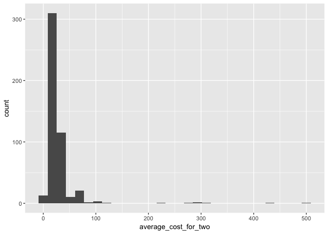
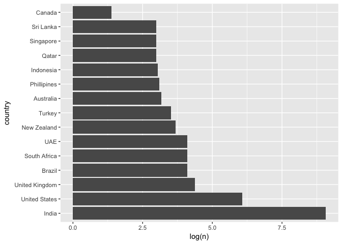

PROJECT TITLE
================
kimchi-stew
March 25th, 2018

Section 1. Introduction
-----------------------

What distinguishes an "excellent" restaurant from others. (excellent defined by Zomato users) This dataset is from Kaggle, collected using the Zomato API. Zomato is a platform where people can contribute ratings of restaurants around the world.
The variables are restuarant ID, resturant name, country code, city, address, locality, locality verbose, longitude, latitude, cuisines, average cost for two, currency, has table booking, has online delivery, is delivering now, switch to order, price range, aggregate rating, rating color, rating text, votes.

Section 2. Data analysis plan
-----------------------------

The outcome is the rating text (categorical variable), and the predictors are cuisines, average cost for two(which we need to convert the currency to usd later), has online delivery, location (longitude and latitude).

Statistical methods: Multiple linear regression + Model Selection Hypothesis testing Plotting/mapping of data points

First we'll load up the data.

``` r
library(tidyverse)
library(janitor)
library(readxl)
zomato <- read_csv("../data/zomato.csv", locale = locale(encoding = "latin1"))
zomato <- clean_names(zomato)

country_codes <- read_excel("../data/Country-Code.xlsx")
country_codes <- clean_names(country_codes)

zomato_country <- zomato %>%
  full_join(country_codes, by = "country_code")
```

Now some preliminary exploratory data analysis:

``` r
zomato %>%
  filter(currency == "Dollar($)") %>%
  ggplot(mapping = aes(x = average_cost_for_two)) +
  geom_histogram()
```

    ## `stat_bin()` using `bins = 30`. Pick better value with `binwidth`.



``` r
zomato_country_cnt <- zomato_country %>%
  count(country)
zomato_country_cnt$country <- factor(zomato_country_cnt$country, 
                                     levels = zomato_country_cnt$country[order(-zomato_country_cnt$n)])

zomato_country_cnt %>%
  ggplot(mapping = aes(y = log(n), x = country)) +
  geom_col() + 
  coord_flip()
```



Hypothesis: there will be two types of "Excellent" restaurants, the first being affordable and the other being expensive and high-end. Additionally, restaurants with a larger number of votes will have a higher aggregate rating.

To support our hypothesis: We will need linear models with high R-squared values, hypothesis tests with p values below the significance level, and the map will show if regional patterns in rating exist as well as how the definition of an excellent restaurant varies geographically.

Section 3. Data
---------------

``` r
glimpse(zomato)
```

    ## Observations: 9,551
    ## Variables: 21
    ## $ restaurant_id        <int> 6317637, 6304287, 6300002, 6318506, 63143...
    ## $ restaurant_name      <chr> "Le Petit Souffle", "Izakaya Kikufuji", "...
    ## $ country_code         <int> 162, 162, 162, 162, 162, 162, 162, 162, 1...
    ## $ city                 <chr> "Makati City", "Makati City", "Mandaluyon...
    ## $ address              <chr> "Third Floor, Century City Mall, Kalayaan...
    ## $ locality             <chr> "Century City Mall, Poblacion, Makati Cit...
    ## $ locality_verbose     <chr> "Century City Mall, Poblacion, Makati Cit...
    ## $ longitude            <dbl> 121.02754, 121.01410, 121.05683, 121.0564...
    ## $ latitude             <dbl> 14.56544, 14.55371, 14.58140, 14.58532, 1...
    ## $ cuisines             <chr> "French, Japanese, Desserts", "Japanese",...
    ## $ average_cost_for_two <int> 1100, 1200, 4000, 1500, 1500, 1000, 2000,...
    ## $ currency             <chr> "Botswana Pula(P)", "Botswana Pula(P)", "...
    ## $ has_table_booking    <chr> "Yes", "Yes", "Yes", "No", "Yes", "No", "...
    ## $ has_online_delivery  <chr> "No", "No", "No", "No", "No", "No", "No",...
    ## $ is_delivering_now    <chr> "No", "No", "No", "No", "No", "No", "No",...
    ## $ switch_to_order_menu <chr> "No", "No", "No", "No", "No", "No", "No",...
    ## $ price_range          <int> 3, 3, 4, 4, 4, 3, 4, 4, 4, 3, 3, 3, 3, 3,...
    ## $ aggregate_rating     <dbl> 4.8, 4.5, 4.4, 4.9, 4.8, 4.4, 4.0, 4.2, 4...
    ## $ rating_color         <chr> "Dark Green", "Dark Green", "Green", "Dar...
    ## $ rating_text          <chr> "Excellent", "Excellent", "Very Good", "E...
    ## $ votes                <int> 314, 591, 270, 365, 229, 336, 520, 677, 6...
