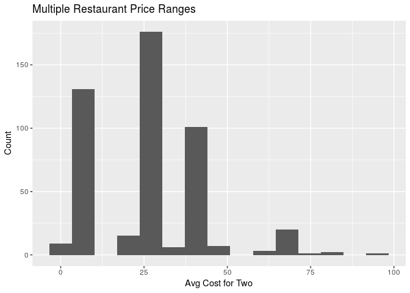
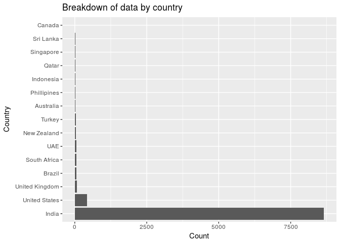

Final Project
================
kimchi-stew
March 25th, 2018

Section 1. Introduction
-----------------------

We are looking at a restaurant dataset from Kaggle, collected using the Zomato API. Zomato is a platform where people can contribute ratings of restaurants around the world, and this dataset is a collection of all available ratings. Data was collected from the Zomato platform in the form of .json files.

For our final project, we are investigating what distinguishes an "excellent"-rated restaurant from others? What are some of characteristics that define an excellent restaurant and do these qualities vary across regions and cuisines? For our purposes, "excellent" is defined as the rating text variable in the dataset. The rating of "excellent" is bestowed to restaurants with an aggregate rating of 4.5 or higher.

The variables recorded in this dataset are: • Restaurant Id: Unique id of every restaurant across various cities of the world
• Restaurant Name: Name of the restaurant
• Country Code: Country in which restaurant is located
• City: City in which restaurant is located
• Address: Address of the restaurant
• Locality: Location in the city
• Locality Verbose: Detailed description of the locality
• Longitude: Longitude coordinate of the restaurant's location
• Latitude: Latitude coordinate of the restaurant's location
• Cuisines: Cuisines offered by the restaurant
• Average Cost for two: Cost for two people in different currencies
• Currency: Currency of the country
• Has Table booking: yes/no
• Has Online delivery: yes/ no
• Is delivering: yes/ no
• Switch to order menu: yes/no
• Price range: range of price of food
• Aggregate Rating: Average rating out of 5
• Rating color: depending upon the average rating color
• Rating text: text on the basis of rating
• Votes: Number of ratings casted by people

There is an auxiliary dataset with country code, and country name.

Section 2. Data analysis plan
-----------------------------

The outcome we are interested in is the rating text (categorical variable), and the predictors are cuisines, average\_cost\_for\_two(which we need to convert the currency to USD later), has\_online\_delivery, and location (longitude and latitude).

Statistical methods that we will be able to use in this project include: multiple linear regression & model selection, hypothesis testing, and plotting/mapping of data points.

### Preliminary Data Analysis

First we'll load up the data.

``` r
library(tidyverse)
```

    ## Warning: running command 'timedatectl' had status 1

``` r
library(janitor)
library(readxl)

zomato <- read_csv("../data/zomato.csv", locale = locale(encoding = "latin1"))
zomato <- clean_names(zomato)

country_codes <- read_excel("../data/Country-Code.xlsx")
country_codes <- clean_names(country_codes)

# joining together files to get country names with rest of data
zomato <- zomato %>%
  full_join(country_codes, by = "country_code")
```

Now some preliminary exploratory data analysis:

``` r
zomato %>%
  group_by(country) %>%
  summarise(median_rating = median(aggregate_rating),
            mean_price_range = round(mean(price_range),1)) %>%
  arrange(desc(median_rating))
```

    ## # A tibble: 15 x 3
    ##    country        median_rating mean_price_range
    ##    <chr>                  <dbl>            <dbl>
    ##  1 Phillipines             4.50             3.40
    ##  2 Indonesia               4.30             3.00
    ##  3 New Zealand             4.30             3.10
    ##  4 Turkey                  4.30             2.80
    ##  5 UAE                     4.25             3.20
    ##  6 South Africa            4.20             3.60
    ##  7 Brazil                  4.15             3.40
    ##  8 United Kingdom          4.10             2.80
    ##  9 Qatar                   4.00             3.60
    ## 10 Sri Lanka               4.00             2.80
    ## 11 United States           4.00             2.00
    ## 12 Singapore               3.75             3.60
    ## 13 Australia               3.70             2.10
    ## 14 Canada                  3.50             2.50
    ## 15 India                   3.10             1.70

We can start looking at some summary statistics of our numerical variables to get an idea of the typical values for each of these variables and if these vary siginificantly from country to country. The median ratings range from 3.1 to 4.5 (out of 5) by country, while price ranges from 1.7 to 3.6 (out of 4) by country. India has both the lowest median rating and lowest mean price range off all of the countries.

Next we can look at some visualizations.

``` r
zomato_us <- zomato %>%
  filter(currency == "Dollar($)")

zomato_us %>%
  filter(average_cost_for_two < 100) %>%
  ggplot(mapping = aes(x = average_cost_for_two)) +
  geom_histogram(bins = 15) +
  labs(x = "Avg Cost for Two", y = "Count", title = "Multiple Restaurant Price Ranges")
```



I adjusted the graph to get rid of some of the outliers that were $100+. From this distribution we can already see that there is some price stratification, with restaurants clustering around $5, $25, and $40. This pattern will likely show up in other metrics and seeing this pattern now will help us make sense of the distributions later.

``` r
# reorder levels of factor by counts
zomato_cnt <- zomato %>%
  count(country)
zomato_cnt$country <- factor(zomato_cnt$country, levels = zomato_cnt$country[order(-zomato_cnt$n)])

zomato_cnt %>%
  ggplot(mapping = aes(y = n, x = country)) +
  geom_col() + 
  coord_flip() +
  labs(x = "Country", y = "Count", title = "Breakdown of data by country")
```



The vast majority of our data is from India. This is good to know because consumer behaviors vary greatly by country. If we find any trends, they may only generalize to India, and not to the other countries we have information on. We do have a sizable amount of data from the US (~500 restaurants) so we may be able to find statistically significant results there as well.

### Hypotheses

Hypothesis: there will be two types of "Excellent" restaurants, the first being affordable and the other being expensive and high-end. Additionally, restaurants with a larger number of votes will have a higher aggregate rating.

To support our hypothesis: We will need linear models with high R-squared values, hypothesis tests with p values below the significance level, and the map will show if regional patterns in rating exist as well as how the definition of an excellent restaurant varies geographically.

Section 3. Data
---------------

``` r
glimpse(zomato)
```

    ## Observations: 9,551
    ## Variables: 22
    ## $ restaurant_id        <int> 6317637, 6304287, 6300002, 6318506, 63143...
    ## $ restaurant_name      <chr> "Le Petit Souffle", "Izakaya Kikufuji", "...
    ## $ country_code         <dbl> 162, 162, 162, 162, 162, 162, 162, 162, 1...
    ## $ city                 <chr> "Makati City", "Makati City", "Mandaluyon...
    ## $ address              <chr> "Third Floor, Century City Mall, Kalayaan...
    ## $ locality             <chr> "Century City Mall, Poblacion, Makati Cit...
    ## $ locality_verbose     <chr> "Century City Mall, Poblacion, Makati Cit...
    ## $ longitude            <dbl> 121.02754, 121.01410, 121.05683, 121.0564...
    ## $ latitude             <dbl> 14.56544, 14.55371, 14.58140, 14.58532, 1...
    ## $ cuisines             <chr> "French, Japanese, Desserts", "Japanese",...
    ## $ average_cost_for_two <int> 1100, 1200, 4000, 1500, 1500, 1000, 2000,...
    ## $ currency             <chr> "Botswana Pula(P)", "Botswana Pula(P)", "...
    ## $ has_table_booking    <chr> "Yes", "Yes", "Yes", "No", "Yes", "No", "...
    ## $ has_online_delivery  <chr> "No", "No", "No", "No", "No", "No", "No",...
    ## $ is_delivering_now    <chr> "No", "No", "No", "No", "No", "No", "No",...
    ## $ switch_to_order_menu <chr> "No", "No", "No", "No", "No", "No", "No",...
    ## $ price_range          <int> 3, 3, 4, 4, 4, 3, 4, 4, 4, 3, 3, 3, 3, 3,...
    ## $ aggregate_rating     <dbl> 4.8, 4.5, 4.4, 4.9, 4.8, 4.4, 4.0, 4.2, 4...
    ## $ rating_color         <chr> "Dark Green", "Dark Green", "Green", "Dar...
    ## $ rating_text          <chr> "Excellent", "Excellent", "Very Good", "E...
    ## $ votes                <int> 314, 591, 270, 365, 229, 336, 520, 677, 6...
    ## $ country              <chr> "Phillipines", "Phillipines", "Phillipine...
